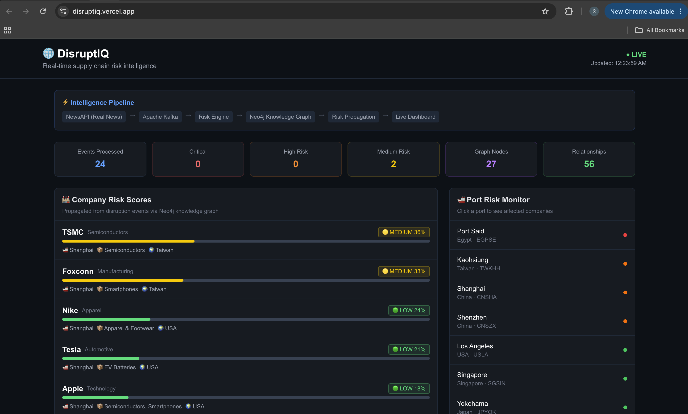
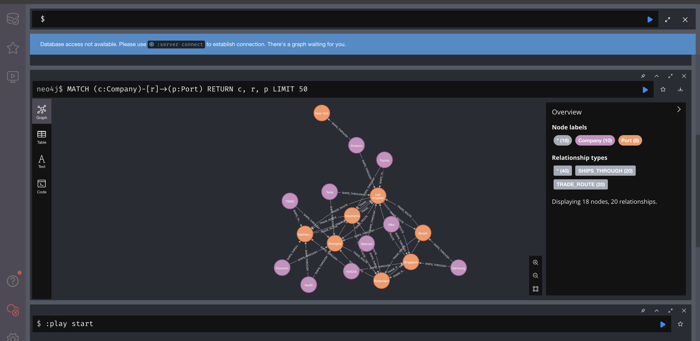
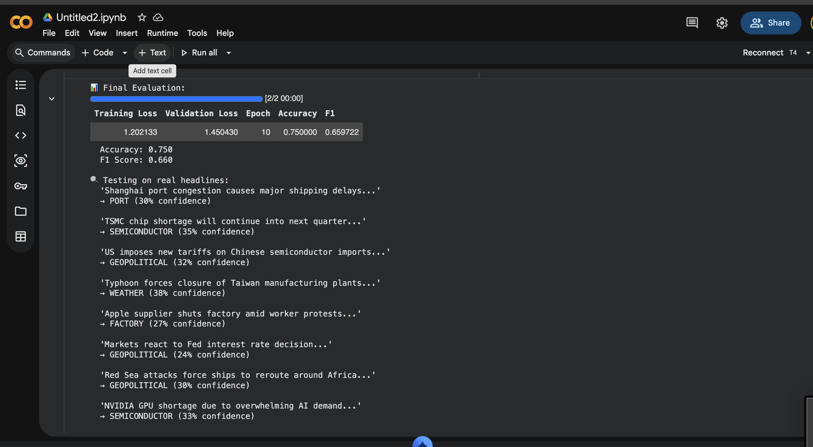

# 🌐 DisruptIQ

> Real-time supply chain risk intelligence — detects disruptions before they impact your business.

**Live Demo:** https://disruptiq.vercel.app  
**Backend API:** https://disruptiq-api.onrender.com  
**Fine-tuned Model:** https://huggingface.co/Sakshi3027/disruptiq-supply-chain-classifier  
**GitHub:** https://github.com/Sakshi3027/disruptiq  
**Stack:** Neo4j · Apache Kafka · Apache Spark · Fine-tuned DistilBERT · NewsAPI · FastAPI · Next.js

---

## What It Does

DisruptIQ monitors real supply chain news in real-time, classifies disruption events using a fine-tuned ML model, propagates risk through a Neo4j knowledge graph of global supply chain relationships, and surfaces which companies are at risk — before the impact hits.

**Real example from live run:**
- "USTR Greer calls Canada uncooperative as USMCA talks fracture" → **GEOPOLITICAL** disruption
- "Red Sea attacks force ships to reroute around Africa" → **GEOPOLITICAL** → affects Rotterdam, Suez → impacts Walmart, Amazon
- "TSMC chip shortage continues" → **SEMICONDUCTOR** → affects Kaohsiung port → impacts Apple, NVIDIA, Tesla

---


## Screenshots

### Live Dashboard
Real-time company risk scores propagated through the Neo4j knowledge graph. Click any port in the Port Risk Monitor to instantly see affected companies via graph traversal.



### Neo4j Supply Chain Knowledge Graph
10 companies, 10 ports, 56 supply chain relationships. The graph shows how companies connect to ports and trade routes enabling instant risk propagation queries.



### Fine-tuning Training Progress
DistilBERT accuracy improving from 16.7% to 75% over 10 epochs on Google Colab T4 GPU in 90 seconds.



---
## Architecture
```
NewsAPI (real supply chain news)
↓
┌─────────────────────────────┐
│  Fine-tuned DistilBERT      │  Classifies headlines into:
│  llm/classifier.py          │  port / weather / geopolitical /
│  HF: disruptiq-supply-chain │  semiconductor / factory / general
└───────────┬─────────────────┘
↓
┌─────────────────────────────┐
│  Apache Kafka               │  Streams disruption events
│  kafka/disruption_producer  │  Topic: disruptiq_events
└───────────┬─────────────────┘
↓
┌─────────────────────────────┐
│  Apache Spark Streaming     │  Processes micro-batches every 15s
│  spark/streaming_processor  │  Reads from Kafka, queries Neo4j
└───────────┬─────────────────┘
↓
┌─────────────────────────────┐
│  Neo4j Knowledge Graph      │  Supply chain relationships:
│  graph/knowledge_graph.py   │  Company → Port → Trade Route
│  10 companies, 10 ports,    │  Risk propagation via graph traversal
│  56 relationships           │
└───────────┬─────────────────┘
↓
┌─────────────────────────────┐
│  Risk Propagation Engine    │  Calculates composite risk scores
│  spark/risk_engine.py       │  Considers: severity × base_risk × type
└───────────┬─────────────────┘
↓
┌─────────────────────────────┐
│  FastAPI + Next.js          │  Live dashboard
│  disruptiq.vercel.app       │  Company risks + Port monitor
└─────────────────────────────┘
```
---

## Fine-tuned Model

**Model:** `Sakshi3027/disruptiq-supply-chain-classifier`  
**Base:** `distilbert-base-uncased`  
**Task:** Multi-class text classification  
**Classes:** port · weather · geopolitical · semiconductor · factory · general

| Metric | Score |
|--------|-------|
| Accuracy | 75% |
| F1 Score | 0.66 |
| Training samples | 48 |
| Epochs | 10 |

**Sample classifications:**
"Shanghai port congestion causes shipping delays"  → PORT (30%)
"TSMC chip shortage will continue next quarter"    → SEMICONDUCTOR (35%)
"US imposes tariffs on Chinese semiconductor imports" → GEOPOLITICAL (32%)
"Typhoon forces closure of Taiwan factories"       → WEATHER (38%)
"Apple supplier shuts factory amid protests"       → FACTORY (27%)
"Red Sea attacks force ships to reroute"           → GEOPOLITICAL (30%)

Use it directly:
```python
from transformers import pipeline
clf = pipeline("text-classification",
               model="Sakshi3027/disruptiq-supply-chain-classifier")
result = clf("Shanghai port congestion causes shipping delays")
# [{'label': 'port', 'score': 0.302}]
```

---

## Neo4j Knowledge Graph

The supply chain graph models real-world relationships:

```cypher
-- Find all companies affected if Shanghai port is disrupted
MATCH (c:Company)-[:SHIPS_THROUGH]->(p:Port {code: "CNSHA"})
RETURN c.name, c.sector, c.risk_score
ORDER BY c.risk_score DESC
```

**Result:** TSMC (60%), Foxconn (55%), Nike (40%), Tesla (35%), Apple (30%)

**Graph statistics:**
- 10 major global companies
- 10 critical world ports
- 7 product categories
- 56 supply chain relationships

---

## Risk Score Formula

```python
risk_score = min(1.0,
    base_company_risk     # inherent company exposure
    × event_severity      # how severe is the disruption (0-1)
    × type_multiplier     # semiconductor=1.5x, geopolitical=1.4x, port=1.3x
    × 2                   # scaling factor
)
```

---

## Running Locally

```bash
# 1. Clone
git clone https://github.com/Sakshi3027/disruptiq.git
cd disruptiq

# 2. Install
pip install -r requirements.txt

# 3. Start infrastructure
cd docker && docker-compose up -d && cd ..

# 4. Build knowledge graph
python3 graph/knowledge_graph.py

# 5. Run pipeline (3 terminals)
python3 kafka/disruption_producer.py     # Terminal 1: Producer
python3 spark/streaming_processor.py    # Terminal 2: Spark Streaming
python3 spark/risk_engine.py            # Terminal 3: Risk Engine

# 6. Start API
uvicorn api.main:app --port 8084

# 7. Start frontend
cd frontend && npm run dev
```

---

## Project Structure
```
disruptiq/
├── llm/
│   └── classifier.py          # Fine-tuned DistilBERT classifier
├── kafka/
│   └── disruption_producer.py # NewsAPI → Kafka producer
├── spark/
│   ├── streaming_processor.py # Spark Structured Streaming
│   └── risk_engine.py         # Risk propagation engine
├── graph/
│   └── knowledge_graph.py     # Neo4j supply chain graph
├── api/
│   └── main.py                # FastAPI backend
├── frontend/                  # Next.js live dashboard
├── data/
│   └── risk_report.json       # Latest risk assessment
└── docker/
└── docker-compose.yml     # Neo4j + Kafka infrastructure
```
---

## API Endpoints

| Endpoint | Description |
|----------|-------------|
| `/risks` | Company risk scores from latest pipeline run |
| `/alerts` | Recent disruption alerts |
| `/graph/affected/{port_code}` | Companies affected by disrupted port |
| `/graph/stats` | Knowledge graph statistics |
| `/graph/ports` | All ports with risk scores |

---

Built by [Sakshi Chavan](https://github.com/Sakshi3027) · MS Data Science
AI Engineer · Data Engineer · Supply Chain Intelligence · Actively interviewing
